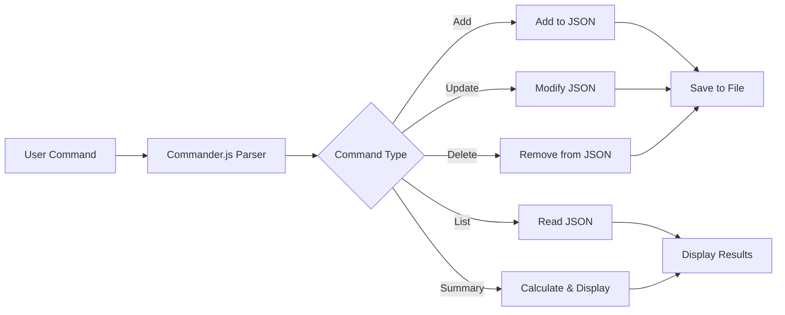

<div align="center">

```
╔═══════════════════════════════════════════════════════════════════════════════╗
║                                                                               ║
║   ░░░░░░░░░░░░░░░░░░░░░░░░░░░░░░░░░░░░░░░░░░░░░░░░░░░░░░░░░░░░░░░░░░░░░░░   ║
║   ░░░▒▒▒▒▒▒▒▒▒▒▒▒▒▒▒▒▒▒▒▒▒▒▒▒▒▒▒▒▒▒▒▒▒▒▒▒▒▒▒▒▒▒▒▒▒▒▒▒▒▒▒▒▒▒▒▒▒▒▒▒▒▒▒▒▒░░░   ║
║   ░░░▒▒▓▓▓▓▓▓▓▓▓▓▓▓▓▓▓▓▓▓▓▓▓▓▓▓▓▓▓▓▓▓▓▓▓▓▓▓▓▓▓▓▓▓▓▓▓▓▓▓▓▓▓▓▓▓▓▓▓▓▓▒▒░░░   ║
║   ░░░▒▒▓▓████████████████████████████████████████████████████████▓▓▒▒░░░   ║
║                                                                               ║
║              💰  E X P E N S E   T R A C K E R   C L I  💰                  ║
║                                                                               ║
║              Your Personal Finance Manager in the Terminal                   ║
║                                                                               ║
║   ░░░▒▒▓▓████████████████████████████████████████████████████████▓▓▒▒░░░   ║
║   ░░░▒▒▓▓▓▓▓▓▓▓▓▓▓▓▓▓▓▓▓▓▓▓▓▓▓▓▓▓▓▓▓▓▓▓▓▓▓▓▓▓▓▓▓▓▓▓▓▓▓▓▓▓▓▓▓▓▓▓▓▒▒░░░   ║
║   ░░░▒▒▒▒▒▒▒▒▒▒▒▒▒▒▒▒▒▒▒▒▒▒▒▒▒▒▒▒▒▒▒▒▒▒▒▒▒▒▒▒▒▒▒▒▒▒▒▒▒▒▒▒▒▒▒▒▒▒▒▒▒░░░   ║
║   ░░░░░░░░░░░░░░░░░░░░░░░░░░░░░░░░░░░░░░░░░░░░░░░░░░░░░░░░░░░░░░░░░░░░░░░   ║
║                                                                               ║
╚═══════════════════════════════════════════════════════════════════════════════╝
```

[](https://nodejs.org/)
[](https://www.javascript.com/)
[](https://choosealicense.com/licenses/mit/)
[](http://makeapullrequest.com)

</div>

---

## 📖 About The Project

A powerful yet simple command-line expense tracker application built with Node.js. Manage your daily expenses efficiently directly from your terminal with an intuitive interface and persistent local storage.

> 💡 **Project Inspiration**: [Roadmap.sh - Expense Tracker](https://roadmap.sh/projects/expense-tracker)

---

## ✨ Features

<table>
<tr>
<td width="50%">

### 📝 Core Functionality
- ✅ **Add Expenses** - Quick expense entry
- 🔄 **Update Records** - Modify existing expenses
- 🗑️ **Delete Entries** - Remove unwanted records
- 👀 **View All** - See complete expense history
- 📊 **Summary Reports** - Total and monthly breakdowns

</td>
<td width="50%">

### 🎯 Technical Features
- 💾 **Local Storage** - JSON-based persistence
- 🚀 **Fast & Lightweight** - Minimal dependencies
- 🎨 **CLI Interface** - Terminal-based interaction
- 🔢 **Auto ID Generation** - Unique identifiers
- 📅 **Date Tracking** - Automatic timestamping

</td>
</tr>
</table>

---

## 🛠️ Tech Stack

<div align="center">

| Technology | Purpose |
|:----------:|:-------:|
| **Node.js** | Runtime Environment |
| **Commander.js** | CLI Argument Parsing |
| **File System (fs)** | Data Persistence |
| **JSON** | Data Storage Format |
| **JavaScript** | Core Programming Language |

</div>

---

## 📦 Installation

### Prerequisites
- Node.js (v14 or higher)
- npm (comes with Node.js)

### Setup Steps

```bash
# 1️⃣ Clone the repository
git clone https://github.com/yourusername/expense-tracker.git
cd expense-tracker

# 2️⃣ Install dependencies
npm install

# 3️⃣ (Optional) Link globally for CLI access
npm link
```

> 🎉 **Success!** You can now use `expense-tracker` command globally!

---

## 🧑‍💻 Usage Guide

### ➕ Add a New Expense

```bash
expense-tracker add --description "Lunch" --amount 20
```

**Output:**
```
✅ Expense added successfully (ID: 1)
```

---

### 📋 List All Expenses

```bash
expense-tracker list
```

**Output:**
```
┌────┬────────────┬─────────────┬─────────┐
│ ID │ Date       │ Description │ Amount  │
├────┼────────────┼─────────────┼─────────┤
│ 1  │ 2024-08-06 │ Lunch       │ $20.00  │
│ 2  │ 2024-08-06 │ Coffee      │ $5.50   │
│ 3  │ 2024-08-07 │ Dinner      │ $35.00  │
└────┴────────────┴─────────────┴─────────┘
```

---

### ✏️ Update an Expense

```bash
expense-tracker update --id 1 --description "Dinner" --amount 25
```

**Output:**
```
✅ Expense updated successfully (ID: 1)
```

---

### 🗑️ Delete an Expense

```bash
expense-tracker delete --id 1
```

**Output:**
```
✅ Expense deleted successfully (ID: 1)
```

---

### 📊 View Summary

**Total Summary:**
```bash
expense-tracker summary
```

**Output:**
```
💰 Total Expenses: $250.50
```

**Monthly Summary:**
```bash
expense-tracker summary --month 8
```

**Output:**
```
📅 Total Expenses for August 2024: $150.75
```

---

## 📁 Data Storage

All expenses are persisted in a local JSON file:

**File Location:** `expenses.json`

**Example Structure:**
```json
[
  {
    "id": 1,
    "date": "2024-08-06",
    "description": "Lunch",
    "amount": 20
  },
  {
    "id": 2,
    "date": "2024-08-06",
    "description": "Coffee",
    "amount": 5.50
  },
  {
    "id": 3,
    "date": "2024-08-07",
    "description": "Dinner",
    "amount": 35
  }
]
```

---

## ⚙️ How It Works



**Key Components:**
1. 🎯 **Commander.js** - Parses CLI arguments and commands
2. 💾 **File System** - Reads and writes to `expenses.json`
3. 🔍 **Data Processing** - Filters, calculates, and formats data
4. 🆔 **ID Management** - Automatically assigns unique IDs
5. 📅 **Date Handling** - Uses JavaScript Date objects for monthly filtering

---

## 🧠 What I Learned

<table>
<tr>
<td>

### 💻 Technical Skills
- Building production-ready CLI tools
- Parsing command-line arguments effectively
- File system operations (read/write)
- JSON data management
- Error handling in Node.js

</td>
<td>

### 🎓 Best Practices
- Writing clean, modular code
- Proper project structure
- User-friendly CLI design
- Data validation
- Documentation standards

</td>
</tr>
</table>

---

## 🚀 Future Improvements

<div align="center">

| Feature | Description | Priority |
|---------|-------------|----------|
| 🏷️ **Categories** | Add expense categorization (Food, Transport, etc.) | High |
| 💰 **Budget System** | Set monthly budgets with warnings | High |
| 📊 **Export to CSV** | Export data for spreadsheet analysis | Medium |
| 🎨 **Colorful Output** | Enhanced terminal colors with Chalk.js | Medium |
| 🗄️ **Database** | Migrate from JSON to SQLite/MongoDB | Low |
| 🧪 **Testing** | Unit tests with Jest | High |
| 📈 **Charts** | Visual expense trends in terminal | Low |
| 🔐 **Encryption** | Secure sensitive financial data | Medium |

</div>

---

## 🤝 Contributing

Contributions are what make the open-source community amazing! Any contributions you make are **greatly appreciated**.

1. Fork the Project
2. Create your Feature Branch (`git checkout -b feature/AmazingFeature`)
3. Commit your Changes (`git commit -m 'Add some AmazingFeature'`)
4. Push to the Branch (`git push origin feature/AmazingFeature`)
5. Open a Pull Request

---

## 📝 License

Distributed under the MIT License. See `LICENSE` for more information.

---

## 📬 Contact

Your Name - [@yourtwitter](https://twitter.com/yourtwitter)

Project Link: [https://github.com/yourusername/expense-tracker](https://github.com/yourusername/expense-tracker)

---

<div align="center">

```
╔═══════════════════════════════════════════════════════════════════════════════╗
║                                                                               ║
║   ░░░░░░░░░░░░░░░░░░░░░░░░░░░░░░░░░░░░░░░░░░░░░░░░░░░░░░░░░░░░░░░░░░░░░░░   ║
║   ░░░▒▒▒▒▒▒▒▒▒▒▒▒▒▒▒▒▒▒▒▒▒▒▒▒▒▒▒▒▒▒▒▒▒▒▒▒▒▒▒▒▒▒▒▒▒▒▒▒▒▒▒▒▒▒▒▒▒▒▒▒▒▒▒▒▒░░░   ║
║   ░░░▒▒▓▓▓▓▓▓▓▓▓▓▓▓▓▓▓▓▓▓▓▓▓▓▓▓▓▓▓▓▓▓▓▓▓▓▓▓▓▓▓▓▓▓▓▓▓▓▓▓▓▓▓▓▓▓▓▓▓▓▓▒▒░░░   ║
║   ░░░▒▒▓▓████████████████████████████████████████████████████████▓▓▒▒░░░   ║
║                                                                               ║
║                 Made with ❤️ by Your Name | 2024                             ║
║                                                                               ║
║              ⭐ Star this repo if you found it helpful! ⭐                    ║
║                                                                               ║
║   ░░░▒▒▓▓████████████████████████████████████████████████████████▓▓▒▒░░░   ║
║   ░░░▒▒▓▓▓▓▓▓▓▓▓▓▓▓▓▓▓▓▓▓▓▓▓▓▓▓▓▓▓▓▓▓▓▓▓▓▓▓▓▓▓▓▓▓▓▓▓▓▓▓▓▓▓▓▓▓▓▓▓▒▒░░░   ║
║   ░░░▒▒▒▒▒▒▒▒▒▒▒▒▒▒▒▒▒▒▒▒▒▒▒▒▒▒▒▒▒▒▒▒▒▒▒▒▒▒▒▒▒▒▒▒▒▒▒▒▒▒▒▒▒▒▒▒▒▒▒▒▒░░░   ║
║   ░░░░░░░░░░░░░░░░░░░░░░░░░░░░░░░░░░░░░░░░░░░░░░░░░░░░░░░░░░░░░░░░░░░░░░░   ║
║                                                                               ║
╚═══════════════════════════════════════════════════════════════════════════════╝
```

**[⬆ Back to Top](#-expense-tracker-cli)**

</div>
